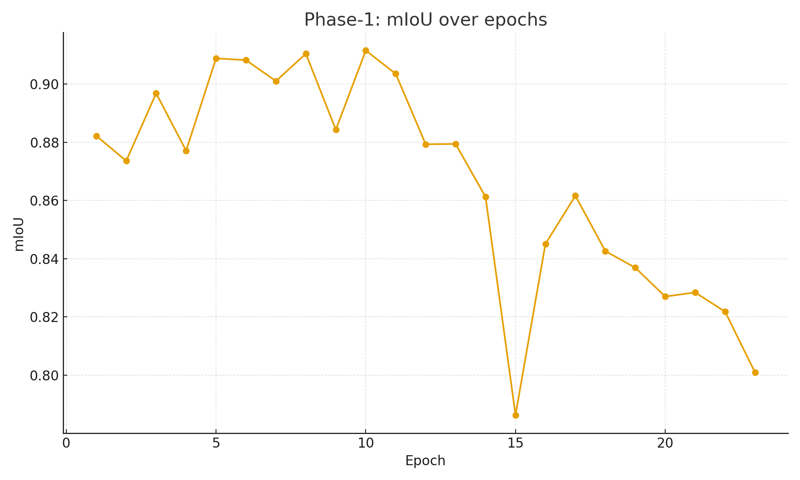
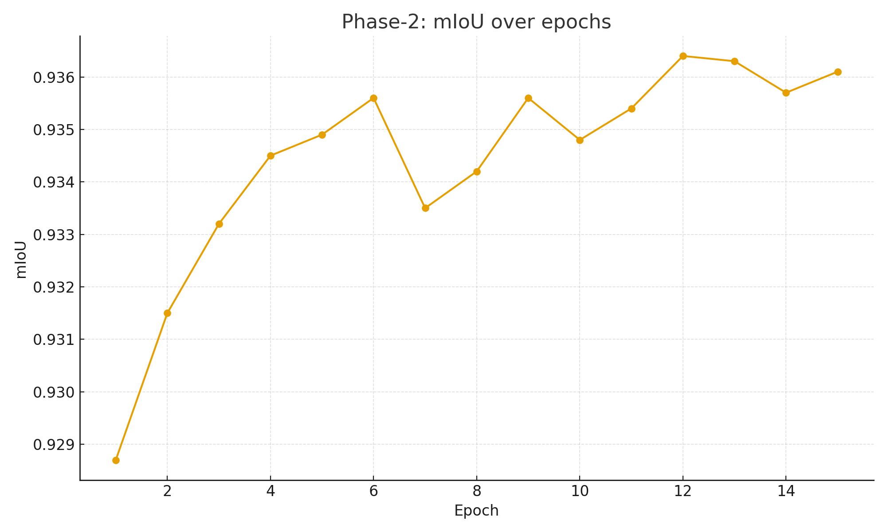

# LoRA-LA: Low-Rank Atom Distillation for Efficient Segmentation

This repository contains the code, training logs, and results for our paper:

**"Efficient Student Segmentation: Reducing Linear Layer Computations with Near-Teacher Accuracy"**  
_Aleksandr Druzhinin, 2025_  

📄 Preprint: [arXiv link (coming soon)](https://arxiv.org)  
📂 Checkpoints and logs: [Google Drive](https://drive.google.com/drive/folders/1Eotm6cXJR0BU6kmUFpOaJP4Tn5lkPoGW?usp=drive_link)  

---

## 🔥 Highlights
- **Teacher**: SegFormer-B0 for binary human segmentation.  
- **Student**: trained with **LoRA-LA (Low-Rank Atom + Delayed Sparsity + KR-hard + EMA)**.  
- **Results**:  
  - Teacher: **0.9366 mIoU**  
  - Student Phase-1: **0.9115 mIoU** (best at epoch 10, 23 epochs total)  
  - Student Phase-2: **0.9364 mIoU** (best at epoch 12, 15 epochs total)  
- **Efficiency**: linear FLOPs reduced by **~5×**, while maintaining **teacher-level accuracy**.  

---

## 📊 Training Curves
<p align="center">
  
  
</p>

---

## 📂 Repository Structure
- `article0_run.ipynb` — training notebook with all logs.  
- `phase1_curve.png`, `phase2_curve.png` — training curves.  
- `phase1_curve.csv`, `phase2_curve.csv` — extracted metrics.  
- `README.md` — project description.  
- (optional) `requirements.txt` — dependencies.  

---

## 🚀 Usage
Clone this repository and open the Jupyter Notebook:

```bash
git clone https://github.com/yourname/lora-la-segmentation.git
cd lora-la-segmentation
jupyter notebook article0_run.ipynb
